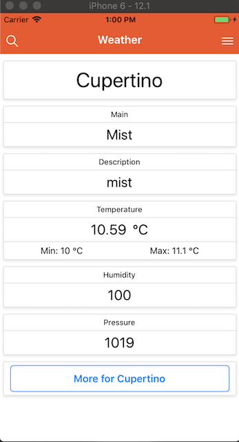
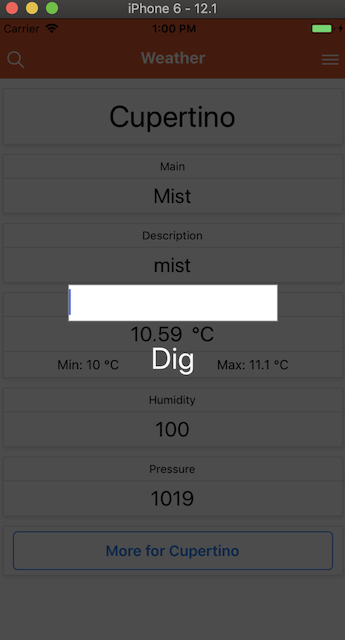
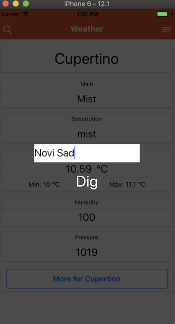
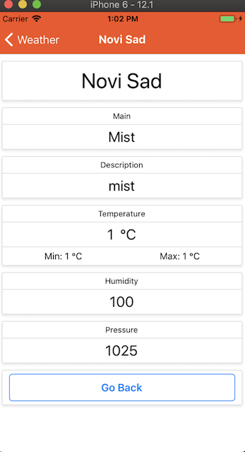
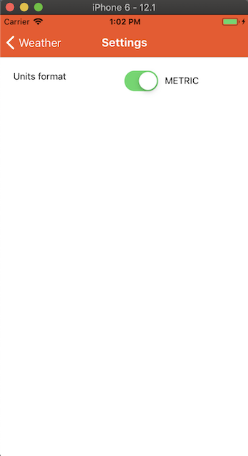

# Weather App

React Native demonstration purpose app

### Prerequisites

* Node

### Setup

Follow https://facebook.github.io/react-native/docs/getting-started for latest setup instructions

### Installing

```
git clone repo
cd repo
yarn|npm install
react-native run-ios|run-android
```
### Todo

* Update details page with more detailed info
* Make settings work
* Add languages to settings
* Make main screen background contextual to current weather

### Preview

<div>
    
    
    
    
    
</div>